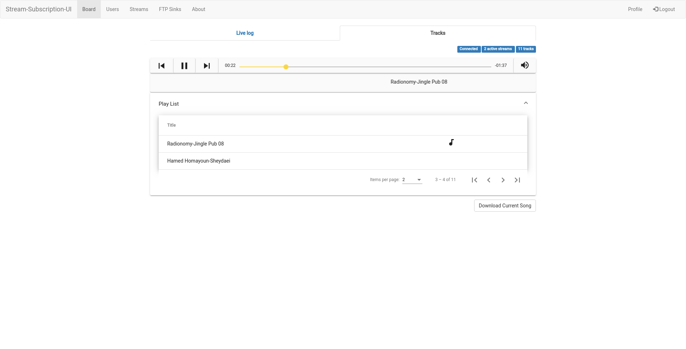

# stream-subscription-ui

By providing an Url and Access Token, this website rips the stream or partitions the stream into `.mp3` file and subsequently uploads the song to a service (ftp, dropbox or etc.)

This service is free, we do not own the ripped `.mp3` files and we do not store them, only store them in your file sharing service.

### URL

- [API](https://stream-subscription-api.herokuapp.com/) URL
- [UI](https://stream-subscription-ui.herokuapp.com/) URL

### Libraries
  - Angular 8.3.*
  - SignalR
  - Angular Material UI
  - ngx-bootstrap
  - RxJS

## Running locally
To to run locally without local back-end use `apiUrl` and `hubUrl` from `environment.prod.ts` in `environment.ts`

#### Screenshot

